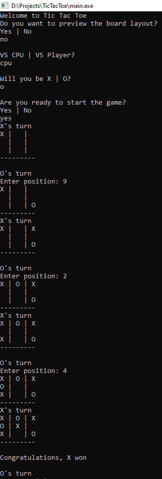
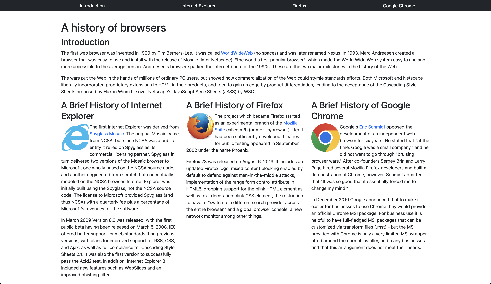

## Why it works
Frameworks are similar to imported libraries where additional functions are used to develop a project without rebuilding the foundation. Without it, it would be like recreating the same function every time you want to use it. Bootstrap has plenty of built-in functions that are commonly used in designing a webpage, therefore we can focus on the designs and features of our program without needing to develop the infrastructure. By using a framework as the foundation, we can then use HTML and CSS to patch up holes that can not be filled by frameworks. It is easier to organize your program when you are using a framework.

Frameworks also have a large community that supports the development of the framework. Frameworks can be an industry standard since so many people use it, so it would make sense for many web-designers to learn it as well. With a huge community comes with a lot of support and contributions. There can be many extensions to these frameworks, allowing users to design with minimal code. 

## How it is going
My personal experience with Bootstrap is by far, better than HTML. Documentations are easy to use and a lot of tools are intuitive and easy to understand. Using Bootstrap so far has been less reliant on CSS, since a lot of parameters can be set in the HTML file. Setting things like columns are easier than pure HTML with the use of "row" and "col". Adding company icons is made easy using Bootstrap's own library, so there is no need to download and import pictures. It seems like managing design elements like images, footers, and navigation bars are made easier with Bootstrap. 

In the future, I want to explore and use other frameworks to see what they provide compared to Bootstrap. I think pure HTML and CSS will not get you very far in web design, at least in the industry. Being able to use a framework efficiently will increase productivity because you are not reinventing the wheel every project. 

