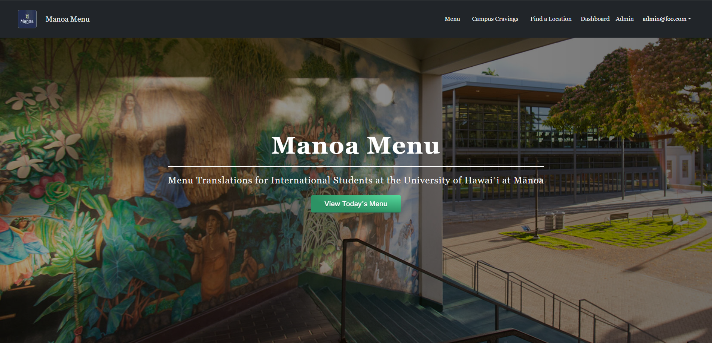
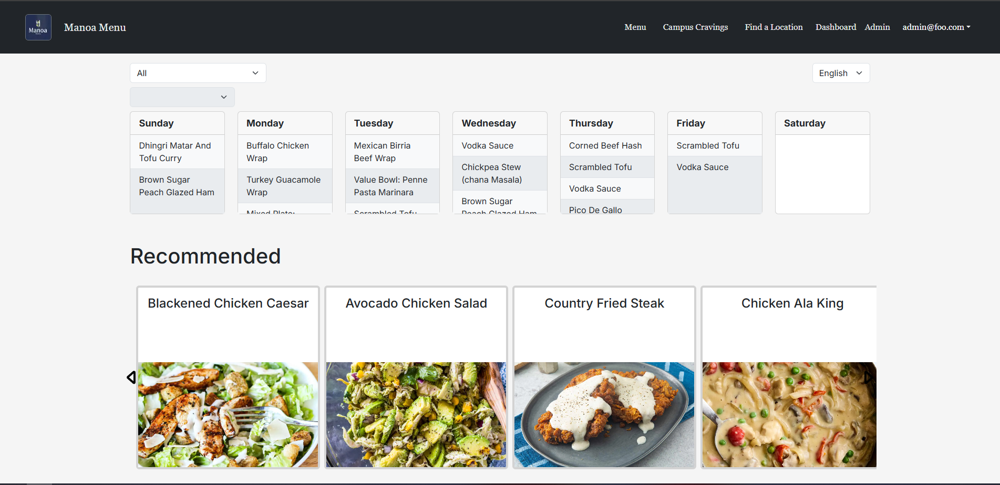
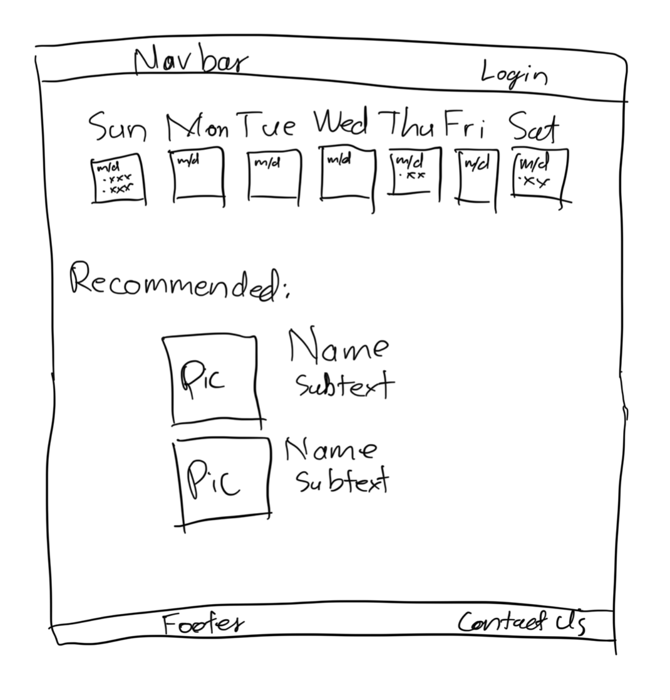
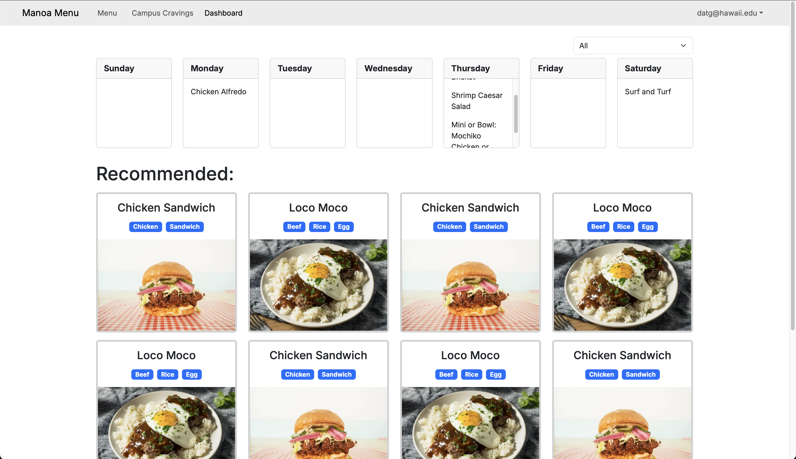
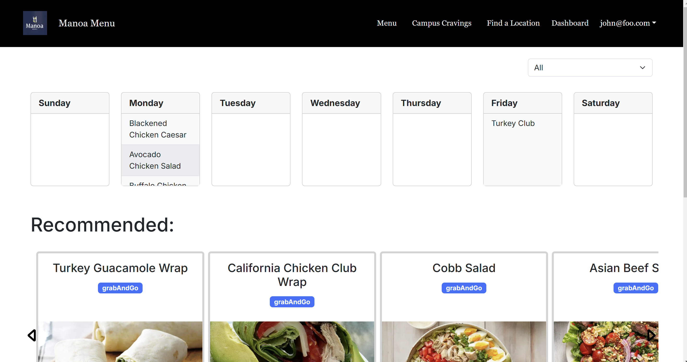
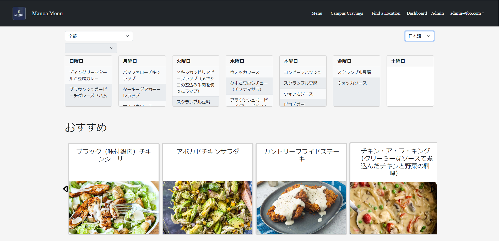

[For my final group project](https://manoa-menu.vercel.app/), I grouped up with 4 others and we decided to work designing a website for uses translation and external data so that we can do API calls. We chose to do something with external data so that we can do API calls and fetch it. The Campus Center Food Court was perfect since their weekly menu is in the form of a pdf. We also wanted to do translation so that we can use ChatGPT API call. As we continued through the development, we added many new features, like the location of these restaurants, as well as dropped a lot of them. The recommendation part of the website in the dashboard is not working as fully intended because I had ran out of time. We are happy for what we have created and most of us had agreed to further develope this website even after this course is finished.

   

My major contribution in this project is the dashboard page. This page function as the main user page, displaying food during the week as well as some recommendation. This page also supports other languages, which for now is just Japanese. The page could be divided into 3 parts, the form selectors, Calendar, and Recommended. Each part of call for a lot of information as well as adding and removing items from the database. But before we look into these components, lets look at the dashboard from conception to finished. 

   

Before we had a functional landing page, each and every one of us drew a mockup for what our pages would look like. Since I was in charged of the dashboard page, my main focus was getting the users' their favorite food for the week and maybe a recommended feature. The calendar would serve as a reminder that the food that you want is returning on certain days. We had decided to use the Campus Center Food Court as well as Gateway Cafe and Hale Aloha Cafe, because they all uses a rotating schedule. This allows us to call for new schedule and fetch it to update our menu. The recommended feature is an additional challenge to fetch an image for the food so that internation students would know what they look like. It would also use an algorithm that features sorting and a max-heap. 

After milestone 1, the basic mockup has been designed and some elementary features promised in the mockup. Milestone 1 was a major part of this page's development since it had set the foundation of the looks for the page. A large part of this milestone was creating components with CSS and Bootstrap-React. The Calendar contained all seven days as well as some test strings within it. I had also included scrollable in the card component to prevent the card resizing. The Recommended component is what I thought would be the best for users to see.

   

In milestone 2, a lot of work was done in the database. We have a table for each food with columns like translation and image url. This allowed me to display all of the food that is not in the user's favorites. The user's favorites is a column in the User table that can be updated on the website. So now, each food card has a name from Campus Center Food Court as well as an image url fetched with SerpAPI and some rudimentary labels. Some minor changes to the page are: alternating light and dark background for each item in Calendar, and an overflow slider for Recommended. 

   

Now back to the current Dashboard, this version now supports the Japanese language and the ability to favorite items. In milestone 3, we have finally enable support for Gateway Cafe and Hale Aloha Cafe, which needed location filters within the dashboard page. The language toggle will also support future languages because I wrote the code with that in mind. Futhermore, my second biggest contribution is the star button and its ability to remove and add items to the user's favorites. This star button is also used in the Menu page, only after the user has logged in. Also, because the dashboard page pulls a lot of information from the database, I had stored a lot of fetch information into the local storage to reduce load time on subsequent reloads. This was because each load used to take from 5-10 seconds which would be too long from a user's perspective. Aside from that, the food card in Recommended and the day card in Calendar are both clickable, which will present the user with a central modal that allows the user to use star button.

   

That is everything about my part of the project. I do plan to continuing its development, like working on the recommended algorithm as well as website-wide language support.

