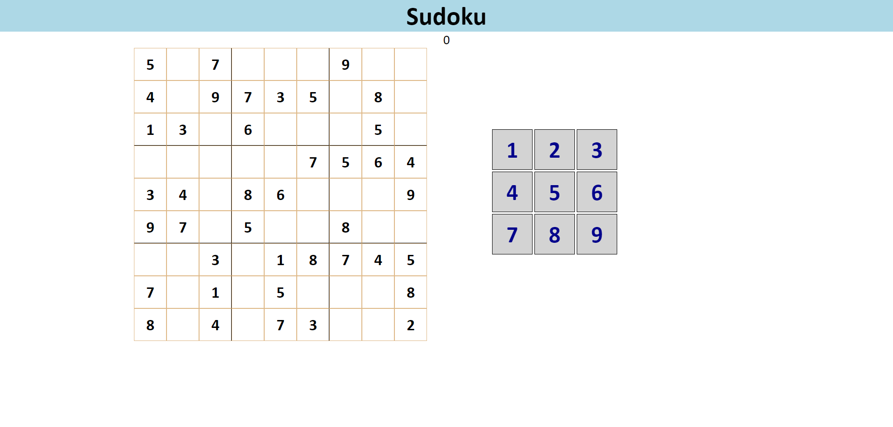

As a way to prepare for ICS314, I wanted to learn a bit about front-end development over the summer. This project was meant for me to get used to HTML and CSS as those were something I have never utilized before. Through it, I have learned about creating divs through JavaScript, how to connect elements between the three, and the frustation in designing with CSS. This program lacks a lot of function that exists in typical Sudoku programs. Things such as, notes, erasing, highlight on number, hints, and many others. Most of the sudoku code was borrowed from [robatron](https://github.com/robatron/sudoku.js/) with a few minor tweaks to fit my code. The focus on this project is CSS and HTML so JavaScript code was not as important. The project is very minimalistic but it got me the experience I wanted.
