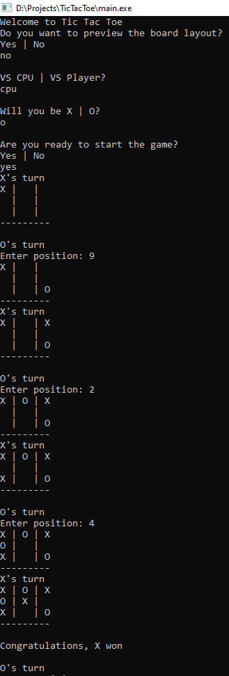

During Spring 2024, I took ICS212 where I learned C and C++. Being quite uncomfortable with C++, I decided to code something simple in order to enhance my knowledge in it. It contained classes, recursion, vector, and others. You can play with two players or with a CPU using a minimax algorithm. This project is my biggest one thus far, containing 4 classes and around 350 lines of code. At first, all I wanted was to get the algorithm for the game to function. Then it began to expand as I added the option to play against either the computer or with another person, each are their own respective classes. This is the most I have spent with a single language, making C++ my most known language. If I had to add more to this project, it would definitely getting the game out of the command console and have its own dedicated program with custom GUI.
